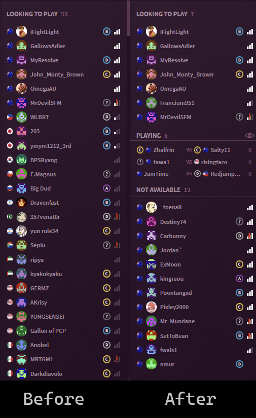

# fightcade-ping-filter
Plugin to filter out users based on ping. Before and after demonstrated below:

[](./img/before-and-after.png)

## Installation

If you have not done so already, download and install the [fightcade-plugin-manager](https://github.com/nmur/fightcade-plugin-manager).

Download `pingFilter.js` from the latest [release](https://github.com/nmur/fightcade-plugin-ping-filter/releases) and place it in your `Fightcade\fc2-electron\resources\app\inject\plugins` directory.

## Configuration
Modify the values to set individual ping limits (in ms) for the user list/matches. Set to 0 to disable the filter.

Add the following to the plugins\config.json:
```json
{
    "pingFilter": {
        "users": 150,
        "matches": 150
    },
}
```
